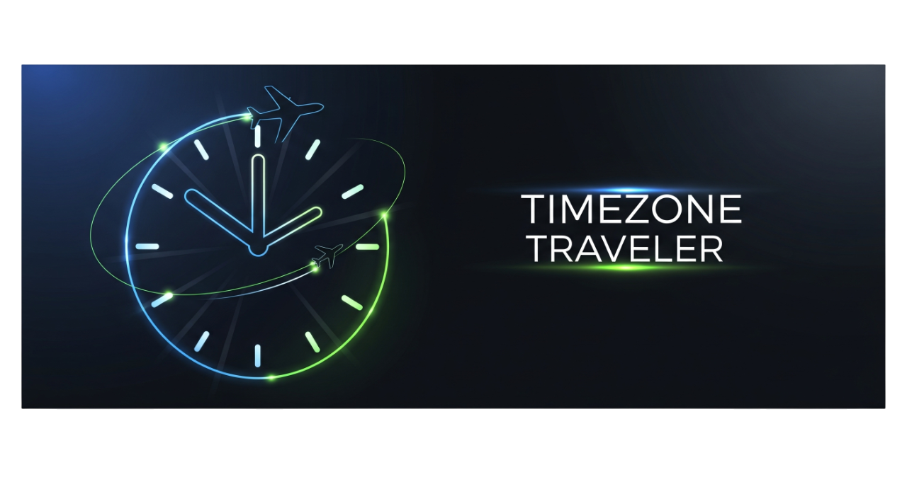
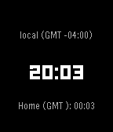
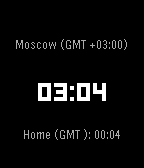
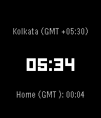
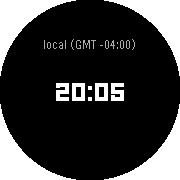

# 🌍 Pebble Traveler



**Never lose track of time across the globe**

A beautiful, customizable world clock collection for your Pebble smartwatch with support for 540+ timezones and GMT offset display. Available in **two versions**: a watch face with tap controls and a standalone app with button navigation.


## 📦 Two Versions Available

### 🎯 Watch Face (v4.0.0) - Tap Controls
**Perfect for:** Users who want timezone display as their main watch face
- **Installation**: As your primary watch face
- **Navigation**: **Tap anywhere** to turn on backlight and cycle through timezones
- **Memory**: 30.5KB footprint
- **Access**: Always visible, no app launching needed

### 📱 Watch App (v2.0.0) - Button Controls
**Perfect for:** Users who prefer precise navigation and want to keep their existing watch face
- **Installation**: As a standalone app alongside your preferred watch face
- **Navigation**: **Physical buttons** for precise control
- **Memory**: 21.9KB footprint (optimized)
- **Access**: Launch when needed, exit protection built-in

## 🎮 Controls Comparison

| Feature | Watch Face (Tap) | Watch App (Buttons) |
|---------|------------------|---------------------|
| **Primary Control** | Tap anywhere | UP/DOWN buttons |
| **Backlight** | Auto with tap | SELECT button |
| **Exit Protection** | N/A (always active) | Hold BACK to exit |
| **Memory Usage** | 30.5KB | 21.9KB |
| **Always Visible** | ✅ Yes | ❌ Launch required |
| **Precision** | ⭐⭐⭐ | ⭐⭐⭐⭐⭐ |

## ✨ Features (Both Versions)

- **Multiple Timezone Support**: Display up to 6 different timezones simultaneously
- **Identical Visual Design**: Same layout, fonts, and colors across both versions
- **Home Timezone Display**: Always shows your home timezone for reference
- **Automatic DST**: Handles Daylight Saving Time for supported timezones
- **GMT Offset Display**: Real-time offset calculation with DST awareness
- **540+ Timezones**: Complete IANA timezone database support
- **Color Customization**: Full color picker for Pebble Color platforms
- **Cross-Platform**: All Pebble devices supported

## 📱 Supported Platforms

| Platform | RAM | Watch Face Memory | App Memory | Status |
|----------|-----|-------------------|-------------|--------|
| Pebble Time (Basalt) | 64KB | 30.5KB | 21.9KB | ✅ Tested |
| Pebble Time Round (Chalk) | 64KB | 30.5KB | 21.9KB | ✅ Tested |
| Pebble Time Steel (Diorite) | 64KB | 30.5KB | 21.9KB | ✅ Tested |
| Pebble 2 HR (Emery) | 128KB | 30.5KB | 21.9KB | ✅ Tested |

## 🚀 Quick Start

### Watch Face Installation
1. Install as your primary watch face
2. Open settings in your Pebble phone app
3. Configure timezones and colors
4. **Tap anywhere** on your watch to cycle through timezones

### Watch App Installation
1. Install as a standalone app
2. Launch from your app menu
3. Configure through settings
4. Use **UP/DOWN** buttons to navigate, **SELECT** for backlight
5. **Hold BACK** button to exit

## 🎯 Control Instructions

### Watch Face - Tap Controls
- **Any Tap** - Turn on backlight and cycle to the next timezone
- **Automatic Lighting** - No need to worry about backlight control
- **Always Active** - No launching required

### Watch App - Button Controls
- **UP Button** - Previous timezone
- **DOWN Button** - Next timezone  
- **SELECT Button** - Toggle backlight
- **BACK Button** - Single press ignored (accident prevention)
- **BACK Button** - Hold 1 second to exit app

## 📸 Screenshots

| Local Time | International | Custom Colors | Cross Platform |
|------------|---------------|---------------|----------------|
|  |  |  |  |

| Local Time | International | Custom Colors | Cross Platform |
|------------|---------------|---------------|----------------|
|  |  |  |  |

## 🛠️ Development

### Prerequisites

- Pebble SDK and command-line tools
- Conda environment (recommended)

### Environment Setup

```bash
# Create conda environment
conda env create -f environment.yml
conda activate pebble-env

# Ensure Pebble tools are in PATH
export PATH="/Users/$USER/.local/bin:$PATH"
```

### Building

```bash
# Build watch-face
cd watch-face
pebble clean && pebble build

# Build watch-app
cd watch-app  
pebble clean && pebble build

# Install to emulator
pebble install --emulator basalt

# Take screenshots
pebble screenshot --emulator basalt
```

### Project Structure

```
pebble-traveler/
├── watch-face/          # Watch face with tap controls (v4.0.0)
├── watch-app/           # Standalone app with buttons (v2.0.0)
├── docs/                # Documentation
├── screenshots/         # App store assets
└── environment.yml      # Conda environment
```

## ⚙️ Configuration Options (Both Versions)

### Timezones
- **540+ Options** - Every timezone from IANA database
- **GMT Offset Display** - Automatic offset calculation with DST
- **Smart Search** - Find cities quickly
- **Home Timezone** - Always visible reference time

### Colors (Pebble Color platforms)
- **Background Color** - Full spectrum picker
- **Time Color** - Main time display color
- **Timezone Label Color** - Small font timezone labels
- **Home Time Color** - Home timezone display color
- **Auto Conversion** - Grayscale on B&W displays

### Display Options
- **Show Seconds** - Toggle seconds on main time
- **Show Home Seconds** - Toggle seconds on home time
- **Always Show Home** - Keep home timezone visible
- **12/24 Hour** - Follow system preference

## 🏗️ Architecture

### Memory Optimization
- **Watch Face**: 30.5KB (traditional watch face overhead)
- **Watch App**: 21.9KB (optimized app implementation)
- **Efficient Heap Usage**: 35KB+ free on 64KB platforms
- **Platform Scaling**: 100KB+ free on Emery (128KB)

### Shared Components
- **Timezone Logic**: Identical DST and offset calculations
- **Display Format**: Same visual layout and fonts
- **Configuration**: Unified Clay-based settings
- **Message Protocol**: 12 message keys for comprehensive configuration

### Version Differences
- **Control Method**: Tap vs button navigation
- **Memory Usage**: 30.5KB vs 21.9KB footprint  
- **Exit Behavior**: Always-on vs protected exit
- **Launch Method**: Watch face vs app menu

## 🚀 CI/CD Pipeline

Automated builds and releases via GitHub Actions:
- **Dual Build Validation** - Both versions tested
- **Memory Checks** - Footprint monitoring for each version
- **Release Automation** - Tagged releases for both packages
- **Conda Environment** - Consistent tooling

## 📚 Additional Documentation

- [Development Guide](docs/DEVELOPMENT.md) - Detailed setup instructions
- [Testing Guide](docs/TESTING.md) - Testing procedures
- [App Information](docs/APP_INFORMATION.md) - Technical details
- [Screenshots](screenshots/README.md) - App store assets

## 🤝 Contributing

Contributions welcome! Please:
1. Fork the repository
2. Create a feature branch
3. Test on all platforms (both versions)
4. Update relevant documentation
5. Submit a pull request

## 📄 License

MIT License - see [LICENSE](LICENSE) for details.

## 👤 Author

**kinncj** - [GitHub](https://github.com/kinncj)

---

*Never miss a meeting across timezones again* 🌍⌚

---

## 📋 App Store Checklist

- ✅ **Watch Face v4.0.0** - Tap navigation, 30.5KB
- ✅ **Watch App v2.0.0** - Button navigation, 21.9KB, exit protection
- ✅ 144x168 pixel screenshots ready
- ✅ Cross-platform compatibility verified
- ✅ Memory optimization completed
- ✅ Dual version documentation
- ✅ Professional documentation
- ✅ MIT License included
- ✅ Automated testing pipeline
- 📦 Ready for Pebble app store submission!
