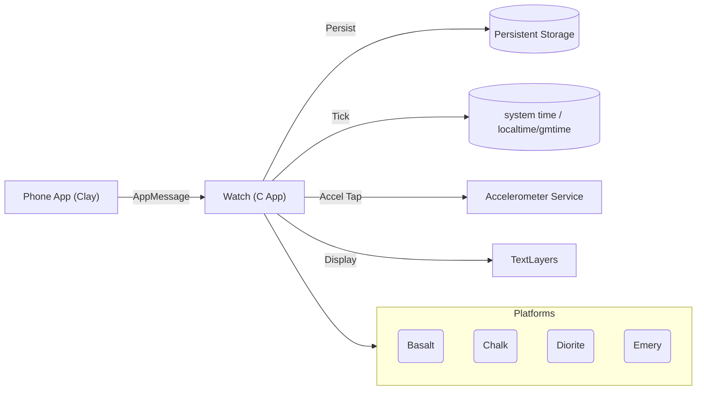
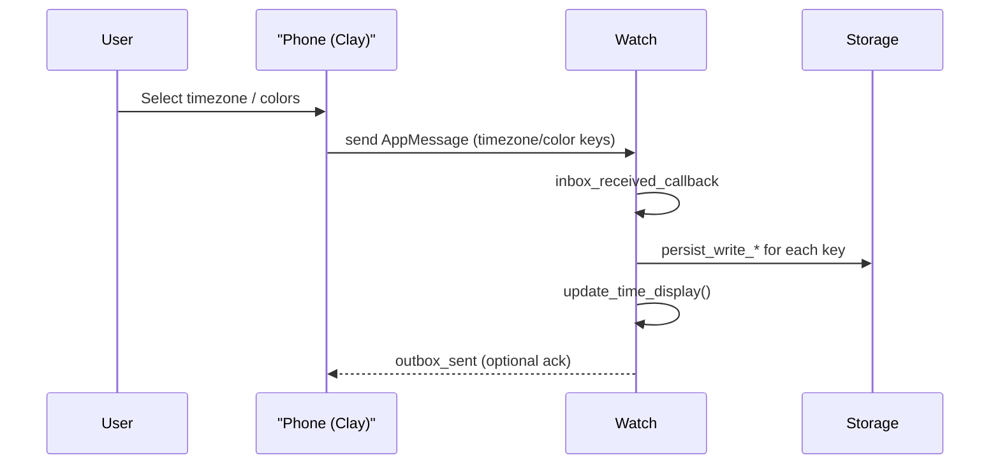

# Diagrams (Mermaid)

This file contains architecture and message-flow diagrams in Mermaid format. Use a renderer that supports Mermaid to view them.

## System Architecture



## AppMessage / Configuration Flow


```
